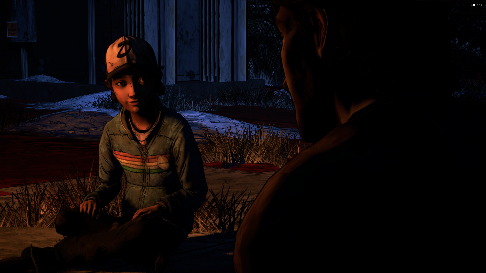
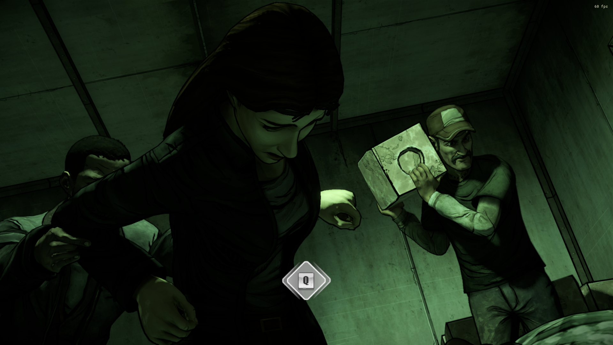
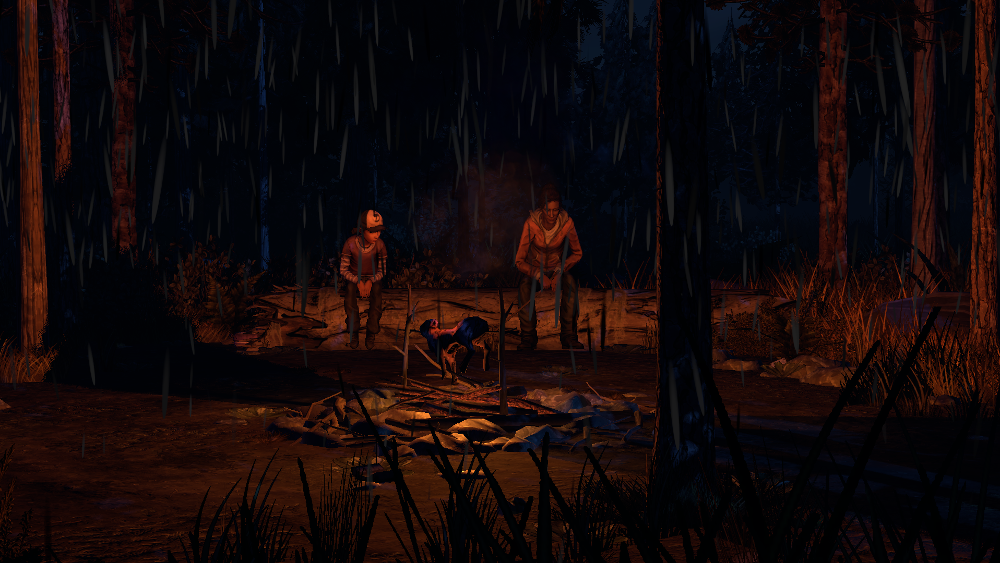

# Definitive Edition Lighting Improvements

### [Download the Mod here](https://github.com/changemymindpls/TTDS-Relighting/releases)

### Install this mod using the [Telltale Mod Launcher](https://github.com/Telltale-Modding-Group/TelltaleModLauncher).

## DISCLAIMER

**This only works for 'The Walking Dead Telltale Definitive Edition'.**
**Not Compatible with [MenuRain](https://github.com/changemymindpls/TTDS-MenuRain) Mod.

## About

This is the Definitive Edition Lighting Improvements Mod (The Walking Dead Telltale Definitive Edition). This mod sets out to "Relight" and improve the many scenes that are in the Definitive Edition.

## Download

**[Download the mod](https://github.com/changemymindpls/TTDS-Relighting/releases)**

**This mod is compatible with the [Telltale Mod Launcher](https://github.com/Telltale-Modding-Group/TelltaleModLauncher) and can be installed using the tool.**

## Screenshots

