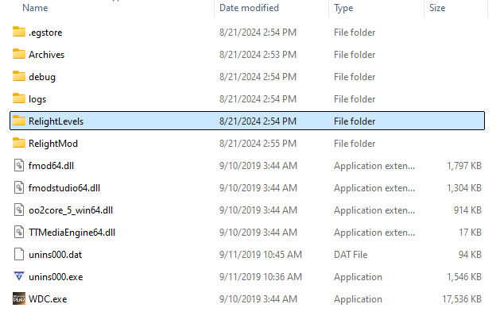

# Relight Mod

Offical Releases

[](https://github.com/changemymindpls/TTDS-Relighting/releases)

### [NEXUS MODS - DOWNLOAD RELIGHT](https://www.nexusmods.com/thewalkingdeadthetelltaledefinitiveseries/mods/1)
### [GITHUB - DOWNLOAD RELIGHT](https://github.com/changemymindpls/TTDS-Relighting/releases)

***If you want to try out the in development version of relight V0.2 then [click here](#building-the-mod-developers). Beware that since it's in development you will be required to build the mod yourself.***

## Table Of Contents
- **[About](#about)**
- **[Screenshots (205 Power Station)](#screenshots-205-power-station)**
- **[Screenshots (102 Meat Locker)](#screenshots-102-meat-locker)**
- **[Screenshots (TLSE | Telltale Lua Script Extensions | Editor Mode)](#screenshots-tlse--telltale-lua-script-extensions--editor-mode)**
- **[Installation](#installation)**
- **[Mod Compatibility](#mod-compatibility)**
- **[Mod Incompatibility](#mod-incompatibility)**
- **[Building The Mod (Developers)](#building-the-mod-developers)**
- **[Making Your Own Level Relight (Developers)](#making-your-own-level-relight-developers)**
- **[Reporting Issues/Bugs/Problems](#reporting-issues)**
- **[Tools Used For Relight Mod](#tools-used-for-relight-mod)**
- **[Relight Mod .ini Files](#relight-mod-ini-files)**
- **[Relight Levels .ini Files](#relight-levels-ini-files)**

## About

This is the Relight Mod for the Walking Dead Telltale Definitive Edition. This is an ambitious mod that sets out to "Relight" and improve graphic fidelity and lighting of the many scenes that are in the game using native engine features and new effects. Many of these level relights are designed to be very configurable from the get-go so you as the user still have full control over what you want! Relight also exposes certain game settings that can be modified at will.

In addition also this mod ships with development/tools features like freecamera, and a level editor! If you are a developer or aspiring mod creator you can actually [create your own Level Relight](#making-your-own-level-relight-developers)!

*NOTE: This is still an early version and some scenes are subject to change, and more are to be added as well...*

**This only works for 'The Walking Dead Telltale Definitive Edition PC'**

## Screenshots *(205 Power Station)*
*NOTE: These are screenshots from Relight V0.2 (These are taken with CinematicMode Enabled)*


## Screenshots *(102 Meat Locker)*
*NOTE: These are screenshots from Relight V0.2 (These are taken with CinematicMode Enabled)*


## Screenshots *(TLSE | Telltale Lua Script Extensions | Editor Mode)*
*NOTE: These are screenshots from Relight V0.2 (With EditorMode Enabled)*


## Installation

### **How to install [Relight v0.1](https://www.nexusmods.com/thewalkingdeadthetelltaledefinitiveseries/mods/1)**

1. Download the .zip file
2. Extract all of the contents of the .zip file into your game's **Archives directory** *(i.e. drag all of the .ttarch2, .lua, .json, and all of those files into the Archives folder of the game).
3. Boot up the game, and play any of the levels that v0.1 modifies and enjoy!

NOTE: V0.1 unfortunately creates some bugs/issues with the game where in a couple of scenes you are unable to progress, so beware.

### **How to install Relight v0.2**

1. Download the zip
2. Extract the contents of the "MOVE_CONTENTS_TO_ARCHIVE_FOLDER" folder to the game Archives directory.
3. Extract the contents of the "MOVE_CONTENTS_TO_GAME_FOLDER" folder *(The RelightLevels folder specifically)* to the main game directory.
4. Boot the game and have fun!

## Mod Compatibility

**This only works for 'The Walking Dead Telltale Definitive Edition PC'**

- ***COMPATIBLE*** with [Load Any Level](https://www.nexusmods.com/thewalkingdeadthetelltaledefinitiveseries/mods/7)
- ***COMPATIBLE*** with any Texture/Model Swap/Sound mods *(provided if none of them modify any of the game level scripts)*

## Mod Incompatibility

- ***NOT COMPATIBLE*** with [Menu Rain](https://github.com/changemymindpls/TTDS-MenuRain)
- ***NOT COMPATIBLE*** with [No Outlines](https://www.nexusmods.com/thewalkingdeadthetelltaledefinitiveseries/mods/5)
- ***NOT COMPATIBLE*** with [Ambience](https://www.nexusmods.com/thewalkingdeadthetelltaledefinitiveseries/mods/6?tab=description)

## Building The Mod (Developers)

If you are intrested in trying out the mod even if there isn't an offical release *(i.e. No offical precompiled/prepackaged zip file that you can just extract into the game normally)*, then it's not to difficult to build it yourself.

1. Download and Install the [Telltale Script Editor](https://github.com/Telltale-Modding-Group/Telltale-Script-Editor-Tweaks) from it's [Releases](https://github.com/Telltale-Modding-Group/Telltale-Script-Editor-Tweaks/releases) page.
2. Download/Clone this repository *(The RelightMod Repository)* to your computer.


3. Open **RelightMod.tseproj** from the downloaded/cloned Relight Repository using [Telltale Script Editor](https://github.com/Telltale-Modding-Group/Telltale-Script-Editor-Tweaks).


4. In the script editor, there are 3 buttons on the top toolbar. **Click the grey gear icon to configure project** and apply the following settings.


**NOTE:** Your game executable here won't be in the same location as the screenshot.

5. Once you configured the project settings, close it then **click the green hammer icon to build the project** *(This may take some time)*.


6. Once the project is finished building, a **Builds** folder will be created in the **File Tree Window** of the script editor. 
If it isn't there then either refresh by right clicking the folder in the application, and click **Refresh**. Or you can right click the folder and click **Open In Explorer** to open the folder in Windows File Explorer. Inside the builds folder there should be a .zip file of the build you just created. 


7. To Install the mod, simply extract the contents of that .zip file into your game's **Archives directory**.
8. ***(TESTING PART 1)*** To make sure you installed the mod correctly, boot into the game and play any scene/level from Season One/Two/Three/Four. Once you do then quickly exit the game and go back to your game directory folder. There should be a new folder created now called **RelightMod** which is where the main configuration files for relight are created and stored.


9. After the core of relight is installed, then we need to include the **RelightLevels** folder into the game directory. So in the cloned/downloaded RelightMod folder that you got from github, there is a **RelightLevels** which contains .lua and .ini files for each level. Simply copy this folder *(Copy the entire folder NOT it's contents)* and drop it into the game directory *(NOT into the Archives folder, just the game directory with the .exe)*.


*Copy the RelightLevels folder from the downloaded RelightMod repository, and pase it into the game directory here...*



10. When you boot/load into an actual scene in the game *(i.e. any level from Season One/Two/Three/Four)* Relight will automatically create a **RelightMod** folder where the main configuration files for relight are stored.
11. ***(TESTING PART 2)*** Now if you installed the **RelightLevels** folder correctly, if you boot into the game and play the specific levels that are modified via the .lua scripts in that folder then you should be able to see level with the modified graphics.

## Making Your Own Level Relight (Developers)

**If you are intresting in making you own level relight, the good news is that you don't need to have any lua programming in order to do it!** You don't need to also have the script editor at all. *(There is a small caveat to this but we will get to that later)*

As a pre-requiste if you are intrested in doing this, I HIGHLY recomend that you install [Load Any Level](https://www.nexusmods.com/thewalkingdeadthetelltaledefinitiveseries/mods/7) as this will DRASTICALLY speed up your workflow. This mod has functionality that allows you to configure the game to skip the boot/menu screens and load directly into a level.

***NOTE: For this we are going to assume that you already have relight installed and setup correctly...***

1. Go into the **RelightMod** folder and open the **RelightConfiguration_Development.ini** file.


2. Under the **DevelopmentTools** section in that .ini file there is a variable called **EditorMode**.

```
[DevelopmentTools]
EditorMode=false
```

Change the value from **false** to **true**.

```
[DevelopmentTools]
EditorMode=true
```

3. **Save the .ini file** and boot into the level that you want to mess with using the editor *(NOTE: The editor mode is active only whenever you boot into a level from Season One/Two/Three/Four)*.
4. To save any changes you make to a level in editor mode, you have to click a button on the very top left labeled **"Export Scene Changes To Lua"**. This will save your scene changes into a .lua file.


5. Once you exported your scene changes to a lua file, close out of the game and navigate to your game directory. In your game directory there should now be a new folder called **TLSEDevelopment**. Inside this folder your exported .lua script will be there.


6. To use your Level Relight preset, simply move the .lua file from **TLSEDevelopment** to the **RelightLevels** folder.


7. Open the game and boot into that level you just modified and you should be able to play with the changes you made!

**NOTE:** By default relight assumes that name of the file matches what the editor exports originally. If you change the name of the file then relight will not see it. In order to fix this you need to open the **RelightMod** folder in your game directory, open the coresponding .ini file that matches the season that you modified a level from. 

For example if you modified a scene/level from Season 4 then you need to open the **RelightConfiguration_Season4.ini** file. In the file find the name of the level that you modified and change the **RelightSceneLuaFile** to match the new path/name of your .lua file.


**EXAMPLE**: Original path

```
[Level_401_TrainStation]
RelightSceneLuaFile=RelightLevels/RELIGHT_401_adv_trainStation.lua
```

Updated path to match the renamed file

```
[Level_401_TrainStation]
RelightSceneLuaFile=RelightLevels/RELIGHT_401_myCoolNewRelight.lua
```

### TLSE Editor Notes/Limitations

It's worth noting that while this editor does share resemblence to some 3D software packages, it is only really designed for a specific purpose. Do not expect alot of the same features that you might be used too. The reasons why are either due to the fact that it would take alot of work to implement a specific feature *(often this is the case)*, or it's a feature that isn't really necessary to help me with relight, or it's not possible at the moment due to API limitations.

Granted that I would agree that some of the features would infact make this more user friendly and better to use but there are alot of scenes in the game that need to be done... so compromises have to be made. You can still do quite a bit with the editor, but please... manage your expectations... With each new relight release there is a very good chance that there will be features/changes/improvements to the editor over time... but for the time being please bear with me...

- You can not undo anything at the moment.
- Changes you made to a scene before is not additive through the editor. *(i.e. you can't go back to the same .lua file you made changes to and add more changes ontop right inside of the editor)*
- Some tools might not be fully implemented
- Some properties might not appear to have any effect on the scene *(despite being implemented in the engine, some of these effects are unfortunately stripped out from the final game)*

**NOTE:** About the *"not being able to have additive changes to a scene"*, you can still actually retain your levels changes by taking the most recent .lua file export, copying some of the lua code into your previous .lua file export and you can retain the additive changes that way. It does require modifying the lua script and adding the new stuff in *(and if you are an experienced lua programmer, then this is no problem)* but for those that are not a lua programmer unfortunately that is a limitation.

### Exported Relight Level Lua Script Notes

The neat part about these lua scripts that get exported by the editor, is the fact that they are just raw uncompiled lua source code. You can write your own logic into these lua scripts to do whatever you want. In my level relights I do this to implement logic like volumetric lighting, depth of field autofocusing, and other effects. Relight core will load in these files and call the native lua commands from the engine to load and compile these lua files for use in the game.

The logic or code you write in the lua scripts are all up to you! You can go as far as you would want because this functionality is exposed to the user thanks to relight. Relight comes with an in-development version of an API extender for the games called ***Telltale Lua Script Extensions (TLSE)***. This contains alot of code *(mostly collected over years of R&D and various modding projects)* that extends the existing Lua API provided by the Telltale Tool engine. The source code for ***TLSE*** is all here in the relight repo, but if your intrested in the native [Telltale lua functions you can check them out here](https://github.com/frostbone25/TelltaleLuaScriptingDocumentation).

In addition also with the lua scripts that are generated, you can actually upload them and share them with others. So for example if you are not a fan of a specific level relight that is shipped natively, you can create your own and upload it publically. So all users need to do is just download that lua file you created, place it in their RelightLevels folder and it will just work!

## Reporting Issues

If there are issues or suggestions with the mod please report them to the [Issues](https://github.com/changemymindpls/TTDS-Relighting/issues) tab of this repository. If you need more help you can always visit the [discord](https://github.com/Telltale-Modding-Group) server.

Also if you are going to report an issue/problem you are having... PLEASE BE AS SPECIFIC AND AS DETAILED AS YOU CAN POSSIBLY BE. The more information you provide the easier it will be to help.

## Tools Used For Relight Mod

### [Telltale Script Editor](https://github.com/Telltale-Modding-Group/Telltale-Script-Editor-Tweaks)

This is the main bread and butter of the mod. This is a lua script editor designed to work with Telltale Games and handles the creation of custom .ttarch2 archives, the compilation of the lua scripts, and the packaging of the script mod in a user friendly form.

### [Load Any Level](https://www.nexusmods.com/thewalkingdeadthetelltaledefinitiveseries/mods/7)

This is an immensley helpful mod that RAPIDLY speeds up development time, allowing you to quickly boot into levels without having to wait or dig through menus *(or spend hours playing through the game)* just to get to a specific scene. Highly recomend this mod!

### [DDS D3DTX Converter](https://github.com/iMrShadow/DDS-D3DTX-Converter)

My original DDS / D3DTX converter, upgraded by iMrShadow to support more games and more complex texture layouts. Very helpful and useful for creating custom texture assets that we can use in the game. Either to serve as visual improvements to the game, or for more utilitarian purposes like creating custom textures that can be utilized by the TLSE editor.

## Relight Mod .ini Files

Documentation for variables that would appear on .ini files that are inside of the ***RelightMod*** folder.

### RelightConfiguration_Development.ini

#### **[Version]**
- **ConfigurationVersion**: *(DO NOT MODIFY)* Every Relight .ini file has this property, this is checked against Relight's Core. If the value here does not match the coresponding configuration version value of Relight Mod then this file will be regenerated, removing and overriding any values that you have set for this .ini

#### **[DevelopmentTools]**
- **EditorMode**: ***(true/false)*** This property will enable/disable the TLSE (Telltale Lua Script Extensions) editor that ships with the RelightMod. Allowing you to edit or create your own level Relights. ***[(See here for CRITICAL information on the editor)](#making-your-own-level-relight-developers)***
- **FreeCameraOnlyMode**: ***(true/false)*** This property will enable/disable freecamera mode that ships with the RelightMod. This destroys all other cameras in the scene and creates a custom user controllable camera that you can fly around in the scene.
- **FreeCameraOnlyMode_StartSceneNormally**: ***(true/false)*** This property will ***attempt*** to start the scene normally and run the internal level/game logic. However in certain scenes the presence of the freecamera will break the level. *(NOTE: This property is only active when freecamera mode is enabled)*
- **PerformanceMetrics**: ***(true/false)*** This property will enable/disable a text UI that is displayed on the screen, showing all of the perforance metrics that the engine provides.

#### **[CameraSettings]**
***(NOTE: The properties here apply to the camera used in freecamera mode, and the editor mode)***

- **Camera_SnappyMovement**: ***(true/false)*** This property will enable/disable smoothing done on movement for the freecamera. 
- **Camera_SnappyRotation**: ***(true/false)*** This property will enable/disable smoothing done on looking/rotation for the freecamera.
- **Camera_SnappyZoom**: ***(true/false)*** This property will enable/disable smoothing done on zooming for the freecamera.
- **Camera_PositionIncrementDefault**: ***(number)*** This property controls the default movement speed of the freecamera.
- **Camera_PositionIncrementShift**: ***(number)*** This property controls the movement speed of the freecamera when holding down shift.
- **Camera_FovIncrement**: ***(number)*** This property controls the zoom speed of the freecamera when pressing left mouse button *(zoom in)* or right mouse button *(zoom out)*.
- **Camera_PositionLerpFactor**: ***(number)*** This property controls the movement smoothing factor of the freecamera. Lower values are smoother, higher values are more responsive. *(NOTE: This only works if Camera_SnappyMovement is set to false)*
- **Camera_RotationLerpFactor**: ***(number)*** This property controls the rotation/look smoothing factor of the freecamera. Lower values are smoother, higher values are more responsive. *(NOTE: This only works if Camera_SnappyRotation is set to false)*
- **Camera_ZoomLerpFactor**: ***(number)*** This property controls the zoom smoothing factor of the freecamera. Lower values are smoother, higher values are more responsive. *(NOTE: This only works if Camera_SnappyZoom is set to false)*
- **Camera_FovMin**: ***(number)*** This property controls the minimum field of view for the camera for the zoom range. Lower values are more zoomed in, higher values are more zoomed out.
- **Camera_FovMax**: ***(number)*** This property controls the maximum field of view for the camera for the zoom range. Lower values are more zoomed in, higher values are more zoomed out.
- **Camera_NearPlane**: ***(number)*** This property controls the the minimum distance in which objects are rendered in front of camera. Lower values means less objects close to camera will clip, higher values means you objects closer to camera will clip more.
- **Camera_FarPlane**: ***(number)*** This property controls the the maximum distance in which objects are rendered in the camera. Lower values means objects far away will clip more, higher values means objects far away will clip less.

### RelightConfiguration_Main.ini

#### **[Version]**
- **ConfigurationVersion**: *(DO NOT MODIFY)* Every Relight .ini file has this property, this is checked against Relight's Core. If the value here does not match the coresponding configuration version value of Relight Mod then this file will be regenerated, removing and overriding any values that you have set for this .ini

#### **[Global]**
- **RenderScale**: ***(number)*** This property exposes an internal engine function for setting the scale of the rendering resolution. This acts as a multiplier to your current screen rendering resolution. 1.0 is default, 2.0 means your current screen resolution is doubled, 0.5 means your current screen resolution is halved.
- **FOVMultiplier**: ***(number)*** This is a property on all cameras in the game. 1.0 is default. Higher values means cameras in the game will render wider than usual. Lower values means cameras in the game will render narrower than usual. *(NOTE: This is disabled when CinematicMode is enabled)*
- **CinematicMode**: ***(true/false)*** This is an experimental feature that enables/disables letterboxing *(black bars)*, and this will also override FOVMultiplier to match the aspect ratio reflected by the letterboxing. This will create a cinematic presentation of the game, and will widen the normal camera field of views in the game to avoid cropping in an effort to retain original image compositions.
- **BlackAndWhiteMode**: ***(true/false)*** This is an experimental feature that will override the post processing color filter in scenes to desaturate the image to be black and white.
- **DisableFog**: ***(true/false)*** This property will forcefully disable any fog effects in scenes.
- **DisablePostProcessing**: ***(true/false)*** This property will forcefully disable any post processing effects in scenes.
- **DisableOutlines**: ***(true/false)*** This property will forcefully disable post process cel shaded outlines in scenes. *(NOTE: This does not get rid of any ink lines or black lines that are painted onto textures)*
- **ForceVignetteOff**: ***(true/false)*** This property will forcefully vignette effects in a scene.
- **ForceBloomOff**: ***(true/false)*** This property will forcefully bloom/glow effects in a scene.
- **ForceGraphicBlackOff**: ***(true/false)*** This property will forcefully graphic black effects in a scene.
- **HighQualityDepthOfField**: ***(true/false)*** This property will enable the engine native bokeh sprite generation for depth of field that increases the visual quality of the depth of field. If disabled the engine will fall back to a classic gaussian blur style depth of field with no bokeh sprites.
- **EnableMotionBlur**: ***(true/false)*** This property will enable motion blur in all scenes in the game.
- **MotionBlurIntensity**: ***(number)*** This property will control the intensity of motion blur *(if enabled)* in all scenes of the game. Higher values mean stronger motion blur, lower values mean weaker motion blur.
- **OverrideTimeScale**: ***(true/false)*** This property exposes an internal engine function for setting the time scale of a scene.
- **TimeScaleValue**: ***(number)*** This property *(if OverrideTimeScale is enabled)* controls the time scale of scenes in the game. 1.0 is default. 2.0 is double speed, 0.5 is half speed.

### RelightConfiguration_Season1.ini

#### **[Version]**
- **ConfigurationVersion**: *(DO NOT MODIFY)* Every Relight .ini file has this property, this is checked against Relight's Core. If the value here does not match the coresponding configuration version value of Relight Mod then this file will be regenerated, removing and overriding any values that you have set for this .ini

#### [Level_SeasonAndEpisodeNumber_LevelName] *(Example: Level_101_env_hershelFarmExterior)*
- **RelightSceneLuaFile**: *(string)* This sets the path of the custom relight .lua file for the scene. If the path does not exist, relight won't use a custom .lua file for the scene. *(NOTE: The path is relative to the game executable)*

By default these properties are configured to something like the following... 

***Example: RelightLevels/RELIGHT_101_adv_hershelFarmExterior.scene.lua***

### RelightConfiguration_Season2.ini

#### **[Version]**
- **ConfigurationVersion**: *(DO NOT MODIFY)* Every Relight .ini file has this property, this is checked against Relight's Core. If the value here does not match the coresponding configuration version value of Relight Mod then this file will be regenerated, removing and overriding any values that you have set for this .ini

#### [Level_SeasonAndEpisodeNumber_LevelName] *(Example: Level_101_env_hershelFarmExterior)*
- **RelightSceneLuaFile**: *(string)* This sets the path of the custom relight .lua file for the scene. If the path does not exist, relight won't use a custom .lua file for the scene. *(NOTE: The path is relative to the game executable)*

By default these properties are configured to something like the following... 

***Example: RelightLevels/RELIGHT_101_adv_hershelFarmExterior.scene.lua***

### RelightConfiguration_Season3.ini

#### **[Version]**
- **ConfigurationVersion**: *(DO NOT MODIFY)* Every Relight .ini file has this property, this is checked against Relight's Core. If the value here does not match the coresponding configuration version value of Relight Mod then this file will be regenerated, removing and overriding any values that you have set for this .ini

#### [Level_SeasonAndEpisodeNumber_LevelName] *(Example: Level_101_env_hershelFarmExterior)*
- **RelightSceneLuaFile**: *(string)* This sets the path of the custom relight .lua file for the scene. If the path does not exist, relight won't use a custom .lua file for the scene. *(NOTE: The path is relative to the game executable)*

By default these properties are configured to something like the following... 

***Example: RelightLevels/RELIGHT_101_adv_hershelFarmExterior.scene.lua***

### RelightConfiguration_Season4.ini

#### **[Version]**
- **ConfigurationVersion**: *(DO NOT MODIFY)* Every Relight .ini file has this property, this is checked against Relight's Core. If the value here does not match the coresponding configuration version value of Relight Mod then this file will be regenerated, removing and overriding any values that you have set for this .ini

#### [Level_SeasonAndEpisodeNumber_LevelName] *(Example: Level_101_env_hershelFarmExterior)*
- **RelightSceneLuaFile**: *(string)* This sets the path of the custom relight .lua file for the scene. If the path does not exist, relight won't use a custom .lua file for the scene. *(NOTE: The path is relative to the game executable)*

By default these properties are configured to something like the following... 

***Example: RelightLevels/RELIGHT_101_adv_hershelFarmExterior.scene.lua***

### RelightConfiguration_SeasonM.ini

***NOTE: Michonne support is currently not implemented...***

## Relight Levels .ini Files

Documentation for variables that would appear on an .ini file coresponding to a level.lua file inside of RelightLevels folder. Keep in mind that not every property here will be on a level .ini file as every scene is different.

**NOTE: These only document variables for levels that shipped with the native relight mod, if you have a custom relight level.lua file that you created, or that you got from somewhere else that do not come from the native relight mod, they will not appear here.**

#### **[Version]**
- **ConfigurationVersion**: *(DO NOT MODIFY)* Every Relight .ini file has this property, this is checked against Relight's Core. If the value here does not match the coresponding configuration version value of Relight Mod then this file will be regenerated, removing and overriding any values that you have set for this .ini

#### **[Main]**
- **EnableRelighting**: ***(true/false)*** This property will enable/disable any lighting changes made to the level.
- **ExposureOffset**: ***(number)*** This property modify the "Exposure" property on all cameras in the scene. The higher the value the brighter the image will be. The lower the value the darker the image will be.
- **EnableDepthOfField**: ***(true/false)*** This property will enable/disable Depth of Field for the scene.
- **DepthOfFieldAperture**: ***(number)*** This property controls the strength of the depth of field effect. It is based on actual photography values *(1.4, 2.8, 4.0, 5.6, 8.0)* The lower the number, the stronger the depth of field *(narrows the field of focus)*. The higher the number, the weaker the depth of field *(widens the field of focus)*.
- **EnableVolumetricLighting**: ***(true/false)*** This property will enable/disable Global Volumetric Lighting for the scene. ***Keep in mind this effect is experimental and is performance heavy.***
- **EnableLocalVolumetricLighting**: ***(true/false)*** This property will enable/disable Localized Volumetric Lighting for the scene. ***Keep in mind this effect is experimental and is performance heavy.***
- **EnableProcedualGrass**: ***(true/false)*** This property will enable/disable procedual grass generation for the given scene, adding extra detail to the ground.
- **EnableSkydomeReplacement**: ***(true/false)*** This property will enable/disable skydome replacements. Replacing the sky mesh and texture with a more realistic one for the scene.
- **EnableCharacterLights**: ***(true/false)*** This property will enable/disable character lights. This creates a light for each character and attaches it to a characters face in an effort to lift the brightness of their face in a non ideal lighting situation. This also has the added bonus of creating a shine for character eyes.
- **ForceShadowCastingOnAllMeshes**: ***(true/false)*** This property will attempt to force shadow casting on all meshes in the scene.
- **FixBotchedMaterialColors**: ***(true/false)*** This property will fix improperly set material colors on certain objects in a scene.